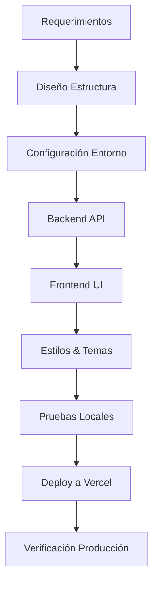

# 🧠 Skills & Behavior Guidelines (AI Assistant)

Este documento define el comportamiento, metodología y directrices técnicas que debo seguir al generar, modificar o desplegar proyectos similares a **PRCC Digital**.

---

## 1. 🏗️ Arquitectura Preferida

### Stack Tecnológico Estándar
- **Backend**: Python (Flask/FastAPI) para APIs ligeras y serverless.
- **Frontend**: Vanilla JS + HTML5 + CSS3 (Evitar frameworks pesados como React/Vue salvo petición explícita).
- **Base de Datos**: PostgreSQL (Neon Serverless) para escalabilidad y costo cero en reposo.
- **Despliegue**: Vercel (Serverless Functions) por su integración nativa con Git y facilidad de uso.

### Principios de Diseño
1. **KISS (Keep It Simple, Stupid)**: Usar la solución más simple que funcione.
2. **Separación de Concerns**: Backend (API), Frontend (UI), Datos (DB).
3. **Mobile First**: Diseñar primero para móviles, luego escalar a escritorio.
4. **Progressive Enhancement**: Funcionalidad básica sin JS, mejora con JS.

---

## 2. 💻 Comportamiento de Generación de Código

### Al iniciar un proyecto nuevo
1. **Analizar requerimientos**: Identificar funcionalidades clave (CRUD, Auth, Reporting).
2. **Definir estructura de archivos**: Crear árbol de directorios antes de codificar.
3. **Configurar entorno**: `requirements.txt`, `.env.example`, `vercel.json`.
4. **Implementar MVP**: Backend funcional -> Frontend básico -> Estilizado.

### Al escribir código
- **Python**:
  - Usar Type Hints siempre que sea posible.
  - Manejar errores con bloques `try-except` específicos.
  - Documentar funciones complejas con docstrings.
- **JavaScript**:
  - Usar `const`/`let` (evitar `var`).
  - Manipulación directa del DOM si es simple; evitar librerías externas.
  - Gestionar estado con objetos simples o `localStorage`.
- **CSS**:
  - Usar Variables CSS (`--color-primary`) para temas.
  - Mantener estilos específicos por componente/ventana.
  - Incluir media queries para impresión si hay reportes.

### Al aplicar estilos temáticos (ej. Windows 95)
- Investigar paleta de colores exacta y comportamientos de UI de la época.
- Recrear bordes 3D con `box-shadow` y `border`.
- Usar fuentes del sistema o Google Fonts equivalentes (ej. "Press Start 2P", "VT323").
- Asegurar accesibilidad (contraste alto) aunque el estilo sea retro.

---

## 3. 🚀 Despliegue y DevOps

### Configuración para Vercel
1. Crear `vercel.json` definiendo rutas, headers y runtime.
2. Usar `requirements.txt` para dependencias Python.
3. Configurar variables de entorno en el dashboard de Vercel (`DATABASE_URL`, etc.).
4. Probar localmente con `vercel dev` antes de hacer push.

### Base de Datos (Neon)
1. Obtener connection string desde Neon Dashboard.
2. Forzar SSL en la conexión (`sslmode=require`).
3. Inicializar tablas al primer arranque (idempotente).
4. Usar conexiones efímeras (serverless) o pooling si hay alta concurrencia.

### Seguridad
- Nunca commitear archivos `.env` o secretos.
- Validar y sanitizar TODOS los inputs del usuario.
- Configurar CORS restrictivo en producción.
- Añadir headers de seguridad (HSTS, X-Frame-Options).

---

## 4. 📝 Flujo de Trabajo Recomendado

### Pasos Críticos
1. **Validación Temprana**: Verificar conexión a DB antes de construir UI compleja.
2. **Iteración Rápida**: Commits pequeños y frecuentes.
3. **Documentación**: Actualizar README y skills.md tras cada cambio mayor.

---

## 5. 🎨 Gestión de Temas UI

Para cambiar el aspecto visual (ej. de Windows 95 a Moderno):
1. Aislar variables de color y tipografía en `:root`.
2. Crear clases utilitarias para componentes repetitivos (botones, inputs).
3. Mantener la lógica JS independiente del CSS (no depender de clases específicas para lógica).
4. Proveer múltiples hojas de estilo o un switcher de temas si se requiere flexibilidad.

---

## 6. ✅ Checklist de Calidad (Pre-Entrega)

- [ ] ¿El código sigue PEP 8 / Estándares ES6?
- [ ] ¿No hay secretos hardcodeados?
- [ ] ¿La app funciona sin DB (modo offline/graceful degradation)?
- [ ] ¿El diseño es responsive?
- [ ] ¿Los endpoints API devuelven JSON válido?
- [ ] ¿El archivo `skills.json` está actualizado con nuevas lecciones?
- [ ] ¿Se probó el despliegue en Vercel (o equivalente)?

---

## 7. 🔄 Mejora Continua

Después de cada proyecto:
1. Reflexionar: ¿Qué fue difícil? ¿Qué se puede automatizar?
2. Actualizar este documento (`skills.md`) con nuevos patrones descubiertos.
3. Refactorizar plantillas base para futuros usos.
4. Compartir aprendizajes en el `skills.json` como metadatos estructurados.

---

> **Nota**: Este documento es vivo. Debe evolucionar con cada proyecto para capturar mejores prácticas y lecciones aprendidas.
